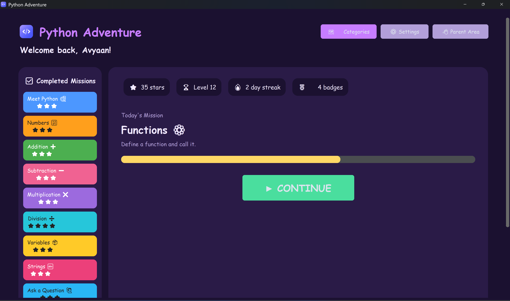
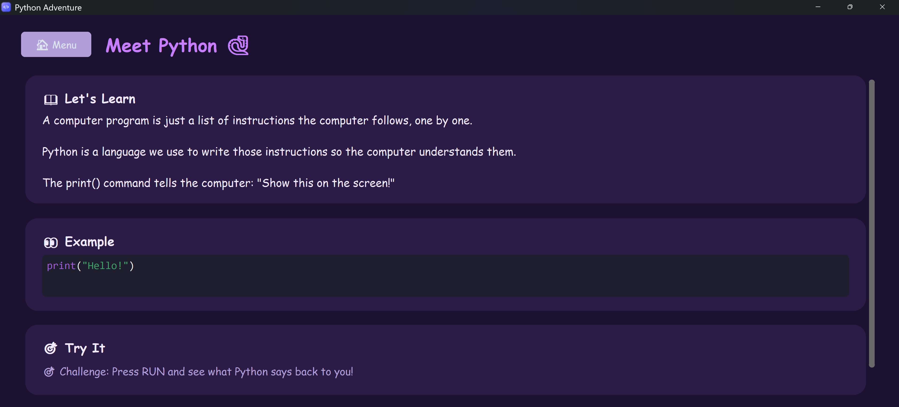
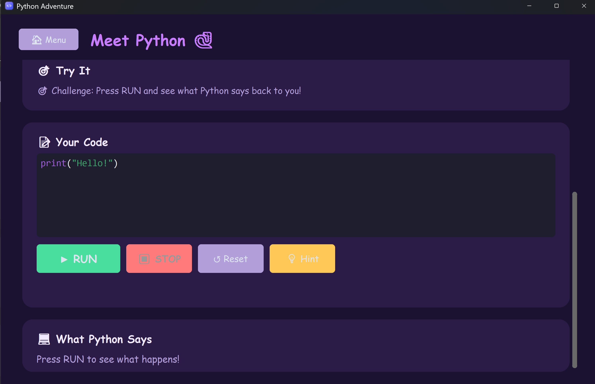

# Python Adventure

A GUI-based Python learning app for kids, built with CustomTkinter.

## Look & feel

| Dashboard | Lesson | Code editor |
|---|---|---|
|  |  |  |

## Status

**Phases 1–6 in progress: 28 lessons complete** (18 main-path + 10 bonus
practice levels). First-run setup wizard, main dashboard, a category
browser, a settings screen with 6 selectable color themes (including two
dark-mode options), local progress storage, a PIN-gated parent area, and
a full lesson flow (explain → example → code editor → run → friendly
errors → reward) work end to end for:

- **Lessons 1–13 (main path)**: Meet Python, Numbers, Addition,
  Subtraction, Multiplication, Division ("Math Master" badge), Variables,
  Strings, Input ("Python Explorer" badge), If/Else, Loops ("Loop Wizard"
  badge), Functions, Lists.
- **Lessons 14–15 (mini-games)**: Guess the Number and Rock, Paper,
  Scissors ("Game Creator" badge) — introduce `random`, and validate by
  pattern rather than exact output since the outcome is randomized.
- **Lessons 16–18 (Snake project, steps 1–3 of the incremental build)**:
  game window, drawing the snake, and moving it with a self-scheduling
  function instead of a loop. Steps 4–13 (keyboard control, food,
  collisions, score, game over, customization) are still to come.
- **Bonus practice levels**: Numbers, Addition, Subtraction,
  Multiplication, and Division each get 2 extra levels (harder numbers,
  chained operations), reachable only through the category browser — see
  "Category browser" below.

See "Graphical lessons" below for how Snake's execution model differs
from the rest of the lessons.

## Running it

**Easiest way (no terminal needed):** double-click `run.bat` (Windows) or
run `./run.sh` (git-bash/macOS/Linux). First run sets up a virtual
environment and installs dependencies automatically (takes a minute);
every run after that just launches the app straight away, with no console
window left open.

Manually, if you prefer:

```powershell
.venv\Scripts\python.exe main.py
```

First run walks through a short setup wizard (child's name + an optional
parent PIN), then lands on the dashboard.

## Running the tests

```powershell
.venv\Scripts\python.exe -m pytest tests\ -v
```

## Project layout

```
app/
  ui/        # screens: setup wizard, dashboard, lesson screen, code editor,
             # category browser, settings/theme picker, shared theme + assets
  config/    # settings persistence (app-data/settings.json)
  progress/  # SQLite-backed progress, stars, badges, streaks, activity log
  parent/    # PIN-gated parent area (summary + recent activity)
  engine/    # lesson model + YAML-based lesson engine + category logic + output validator
  sandbox/   # AST safety check, subprocess runner, restricted worker, error translator
  games/     # GameCanvas/GameWindow + in-process graphical runner (Snake's execution model)
content/
  lessons/   # lesson content (YAML), kept separate from app code
  images/    # app icon (main-icon.png / .ico)
docs/
  app-screenshots/  # images used in this README
tests/       # pytest suite (194 tests)
app-data/    # gitignored — child's settings + progress, created on first run
main.py      # entry point
```

## How it works

Implementation notes for anyone digging into the code — skip this if you
just want to run the app.

### Lesson resolution

`LessonEngine.resolve_current()` decides which lesson a child lands on:
trusts the stored "current lesson" pointer only if it's still valid and
not already completed, otherwise falls back to the first incomplete
lesson in order, or the last lesson if everything is done. This keeps
old progress data working even as lessons are added, removed, or
reordered in content/lessons/.

### Category browser

Every lesson belongs to a `category` (e.g. `"addition"`) and a
`category_level` (its position within that category, 1-based) — set in
its YAML, grouped by `LessonEngine.categories()` /
`lessons_in_category()`. From the dashboard's "🗺️ Categories" button, a
child picks a topic and sees each level in it as completed (⭐ + replay),
ready to play, or locked. `LessonEngine.is_unlocked()` unlocks a level
once every earlier level in the same category is complete — no separate
progress-tracking schema needed, it's derived entirely from
`completed_lesson_ids`.

This is a second, orthogonal way to reach lessons alongside the guided
"Today's Mission" flow. A lesson's `main_path` flag (default `True`)
controls whether it's part of that single guided sequence (chained via
`next_lesson_id`, shown as "Today's Mission") or a bonus level only
reachable through the category browser (`main_path: false`, no
`next_lesson_id`). `next_after()` follows `next_lesson_id` only — no
order-based fallback — specifically so bonus levels (which sort after
lesson 18 by `level`) can never leak into the guided path just because
they come later in file order.

### Code execution sandbox

Child code runs through two layers before anything executes:
1. **Static AST check** (`app/sandbox/safety.py`) — rejects imports and
   dangerous builtins (`eval`, `exec`, `open`, dunder access, …) before any
   process is spawned.
2. **Isolated subprocess** (`app/sandbox/runner.py` + `worker.py`) — runs in
   a separate `python -I` process with a restricted builtins set, a hard
   timeout (default 5s, kills runaway loops), and no filesystem/network
   access granted. The UI can cancel a run mid-flight via `RunHandle`.

Errors are translated into friendly, kid-appropriate messages
(`app/sandbox/errors.py`) with an optional "I'm curious" toggle to reveal
the raw traceback.

### Lessons that take input

A lesson can set `input_prompt` in its YAML to show a labeled answer box
in the lesson screen instead of a terminal-style prompt. Whatever the
child types is piped to the sandboxed process's stdin, and
`expected_output` can contain `{input}` as a placeholder so any answer is
accepted as long as the child's program echoes it back correctly (see
Lesson 9, "Ask a Question"). Code that never receives input closes stdin
immediately, so an unexpected `input()` call fails fast with a friendly
message instead of hanging until the timeout.

### Games with randomness

Lessons 14–15 introduce `random`, which is now allowlisted through both
safety layers (`app/sandbox/safety.py`'s `ALLOWED_MODULES` and
`worker.py`'s restricted `__import__` — everything else stays blocked).
Because the outcome is genuinely random, these lessons validate with
`expected_output_pattern` (a regex covering every valid outcome) instead
of an exact string, via `validate_output()`'s new `expected_output_pattern`
parameter.

### Graphical lessons (the Snake project)

Snake needs a live, continuously-updating window — something the
subprocess-sandboxed model (built for one-shot "run code, capture
stdout" exercises) can't provide. Tkinter widgets must also be created
and touched from the main thread, so this is a deliberate second
execution path with different tradeoffs, not a bug:

- **`app/games/game_canvas.py`** — the only surface a graphical lesson's
  code can touch: `set_title`, `set_background`, `draw_rect`,
  `move_shape`, `set_shape_position`, `delete_shape`, `clear`, `after`
  (schedule a callback without blocking), `on_key` (Up/Down/Left/Right/
  space only). Not a general Tkinter passthrough.
- **`app/games/game_window.py`** — owns the real `CTkToplevel` + `Canvas`
  a lesson draws into; one live window per lesson screen, recreated on
  each RUN.
- **`app/games/graphical_runner.py`** — runs the lesson's code **in the
  main process**, not a subprocess. It still applies the same AST safety
  check and restricted builtins as defense in depth, **plus a `while`-loop
  ban** (`check_code_safety(..., disallow_while=True)`), since there's no
  OS-level timeout here to recover from a runaway loop. Lessons use
  `game.after(ms, callback)` — a self-scheduling function — for animation
  instead, which returns control to Tkinter's own event loop immediately
  and never blocks.
- Validation for graphical lessons is "ran without raising" — the visual
  result in the game window *is* the feedback, matching the visual-first
  philosophy used throughout the app.

A lesson opts into this path with `graphical: true` in its YAML.

## Data storage

Everything lives locally and offline — no cloud, no accounts, no network
access at all. Data is kept in `app-data/` at the repo root (gitignored,
since it's the child's personal progress, not code):
- `settings.json` — child name, parent PIN (salted + hashed), selected
  theme, other preferences
- `progress.sqlite3` — level, stars, badges, completed lessons, activity log

On first run, `get_data_dir()` (`app/config/settings.py`) creates
`app-data/` and, if it finds data from an older version of the app at
`%APPDATA%\PythonAdventure\`, copies it over automatically — so upgrading
never resets a child's progress.
