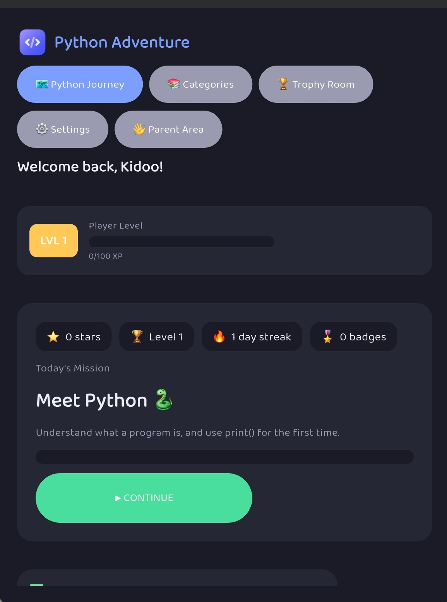
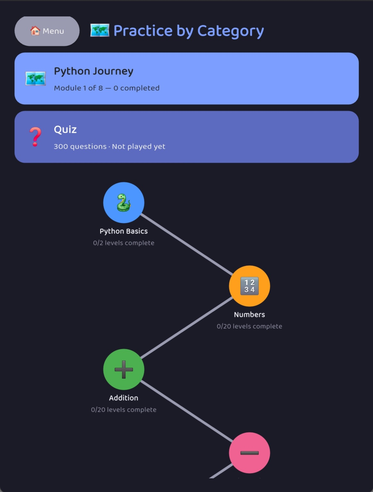
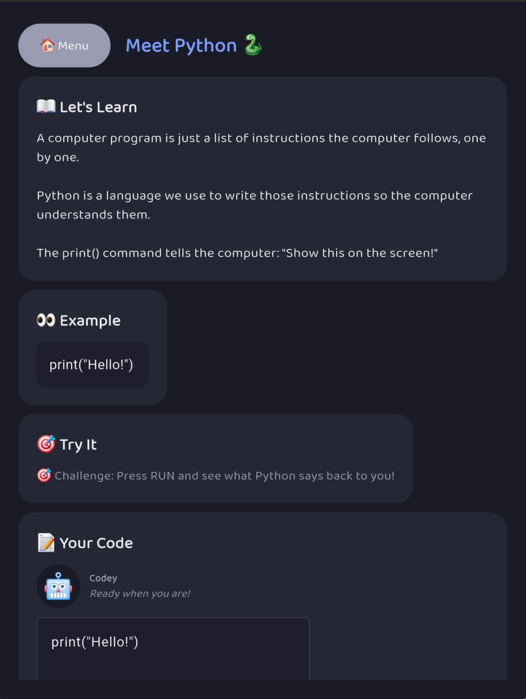
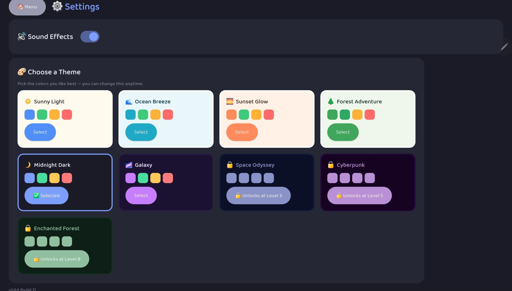

# Python Adventure

A GUI-based Python learning app that grows with you — from a child typing
their very first `print("Hello!")` to an experienced developer keeping
their skills sharp. One offline app, no accounts, no cloud, nothing to
sign up for.

## Who it's for

- **Kids learning Python for the first time** — a guided, game-like path
  through the basics, with encouragement, rewards, and friendly error
  messages instead of intimidating stack traces.
- **Anyone brushing up or going deeper** — hundreds of bite-sized practice
  levels across every core topic, mini-games, and a quiz bank to test
  yourself.
- **Experienced programmers** — the **Advanced Code Crackers** category is
  built specifically for people who already know how to code and want to
  keep their instincts fast: real-world Python gotchas (closures, mutable
  defaults, floating-point precision, aliasing vs. copying, and more) to
  debug, not tutorials to sit through.

## Look & feel

*Screenshots below are from an earlier build and don't yet reflect the
current Learning Hub landing screen, updated level counts, or the newer
Settings font controls — due for a refresh.*

**Dashboard**

**Practice by Category**

**Lesson: Meet Python**

**Settings**

## What's inside

- **Today's Mission** — a guided daily path that starts with the basics
  and works through Numbers, Addition, Subtraction, Multiplication,
  Division, Variables, Strings, Input, Decisions, Loops, Functions, and
  Lists a level at a time, looping back around for deeper levels as you go.
- **Python Learning course** — a structured 9-chapter course (Intro &
  Setup, Variables & Data Types, Control Flow, Functions, Data
  Structures, Advanced Programming Concepts, Standard Library Deep Dive,
  Concurrency & Observability, Capstone: To-Do App). Most chapters go
  deeper by splitting into their own topics instead of one flat lesson:
  Intro & Setup covers Print, Comments, and Reading Errors; Variables &
  Data Types covers Variables, Numbers, Strings, Booleans, and Type
  Conversion; Control Flow covers Conditionals, For Loops, and While
  Loops; Functions covers Defining Functions, Parameters, and Return
  Values; Data Structures covers Lists, Tuples, Dictionaries, and Sets;
  Advanced Programming Concepts covers Algorithms, Recursion, and
  Functional Programming; Standard Library Deep Dive covers Collections,
  Itertools, Datetime, and JSON; and Concurrency & Observability covers
  Concurrency & Async, Thread Scheduling, Sync vs Async, and
  Observability — taught as simulated, concept-only exercises rather than
  real threading/asyncio, since this app's sandbox hard-kills code after a
  timeout and doesn't compose safely with real concurrency. Every topic
  still gets its own "What is it?" explanation, a hands-on sample program,
  and a topic quiz — 90 lessons in all.
- **AI & Machine Learning course** — a second, standalone 3-chapter course
  (AI Foundations, Machine Learning & Tools, Advanced AI Concepts) with its
  own dashboard, parallel to Python Learning, deliberately ordered
  low-to-high level. AI Foundations (beginner) covers What is AI?,
  Rule-Based Decisions (including a simulated rule-based chatbot exercise),
  and Types of AI (narrow vs. general); Machine Learning & Tools
  (intermediate) covers What is Machine Learning? (with a "Train the Robot"
  pattern-matching mini-game) and What is MCP?; Advanced AI Concepts covers
  Neural Networks and a deeper MCP Framework topic (tools, resources, and
  prompts as the three request kinds). Every concept is taught through
  plain-Python simulation — dictionaries, if/elif chains — since the
  sandbox has no real AI/ML libraries. 21 lessons in all.
- **Practice by Category** — jump into any topic directly and work through
  its full 20-level progression at your own pace, independent of Today's
  Mission.
- **Code Crackers** — 40 short "find the bug and fix it" puzzles covering
  common beginner mistakes: typos, off-by-one errors, wrong comparisons,
  bad indentation, and more.
- **Advanced Code Crackers** — 15 tougher puzzles for people who already
  know Python, covering the kind of subtle bugs that trip up even
  experienced developers. A great way to refresh your memory in a few
  minutes rather than starting a whole new project.
- **Mini-games and projects** — Guess the Number, Rock-Paper-Scissors, the
  Snake project (build a real game step by step), Creative Arts, RPG
  Quests, Arcade Lab, and Robot Adventure.
- **Quiz** — a 336-question multiple-choice quiz covering the whole
  curriculum, reshuffled every time you play, with your best score tracked.
- **Practice Quest** — if you get stuck on the same lesson a few times in a
  row, the app gently suggests related practice to help instead of leaving
  you stuck.
- **Rewards that actually mean something** — stars, badges, player levels,
  and day streaks.
- **A Settings screen that's actually comfortable to use** — multiple color
  themes (including dark mode), adjustable font size and font style so
  text is easy to read on anything from a phone to a desktop monitor, a
  sound toggle, and export/import so progress can be backed up to (or
  restored from) a JSON file — importing always asks for confirmation
  first, since it replaces all current progress.
- **A Parent Area** — a summary of progress, recent activity, a way to
  rename your child's profile, and a way to reset progress if needed.
- **100% offline and private** — everything runs and stays on your device.
  No accounts, no network access, no data collection.

## Getting started

**Easiest way (no terminal needed):** double-click `run.bat` (Windows) or
run `./run.sh` (git-bash/macOS/Linux). The first run takes a minute to set
itself up; every run after that launches straight into the app.

First launch walks you through a short setup — just a name — and lands you
on the Learning Hub, ready to go.

## For developers

- [docs/DEVELOPMENT.md](docs/DEVELOPMENT.md) — project layout, how each
  subsystem works, running it/testing it.
- [docs/ARCHITECTURE.md](docs/ARCHITECTURE.md) — system context, class
  diagrams, sequence diagrams, the persistence model, and the design
  decisions behind them.
