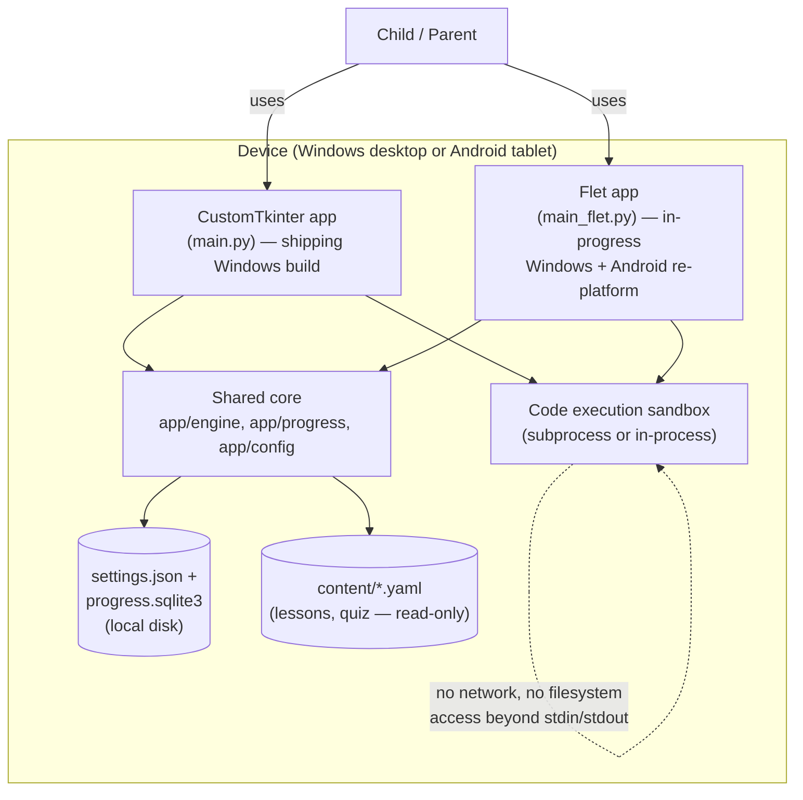
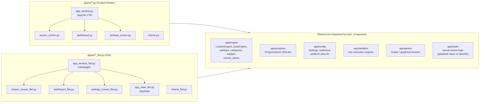
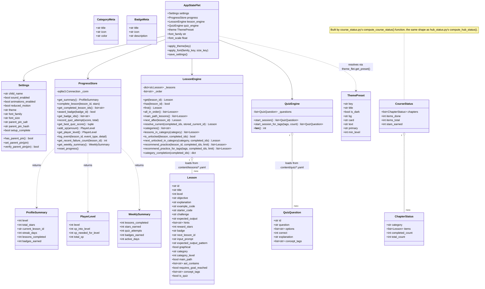
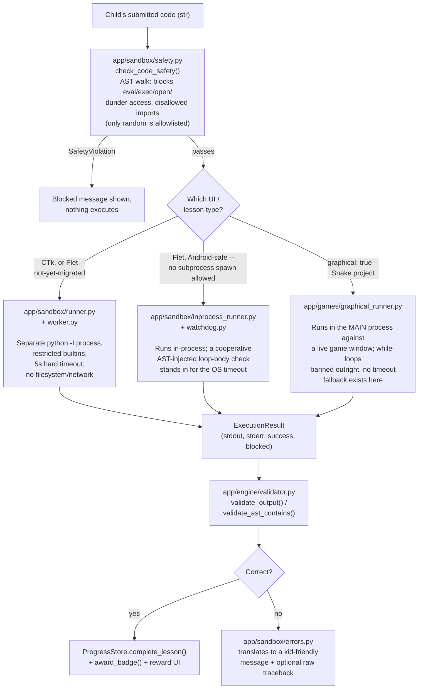
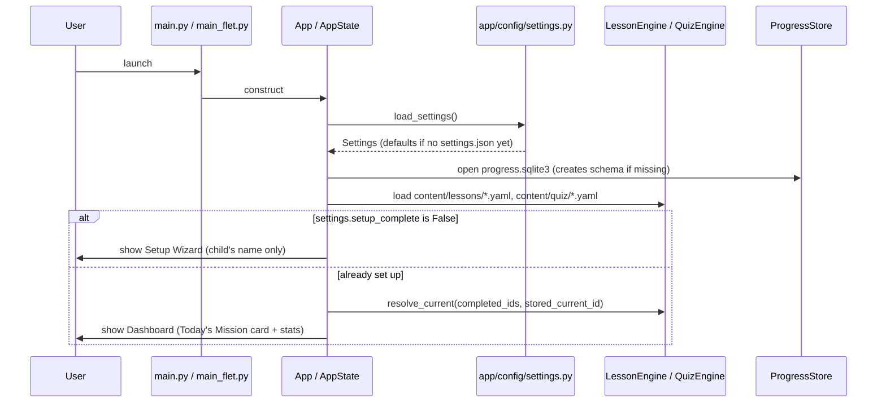
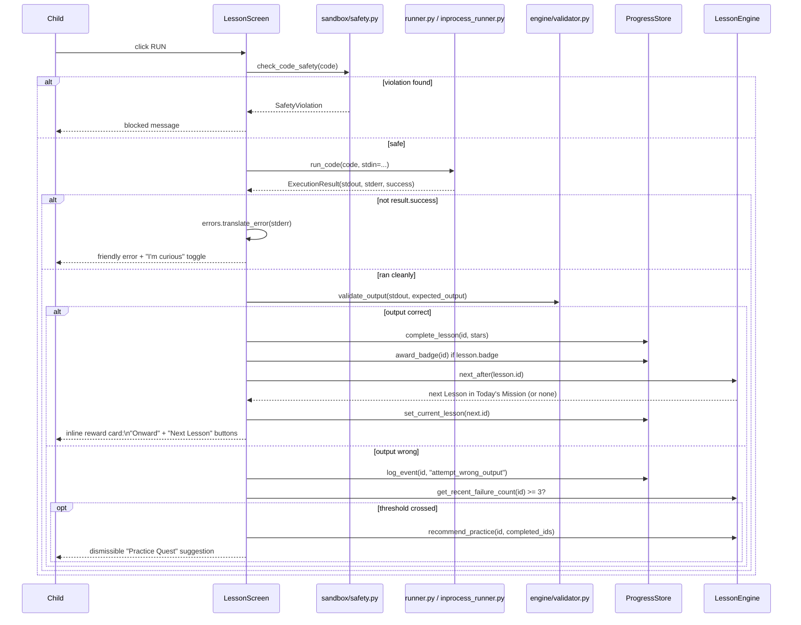
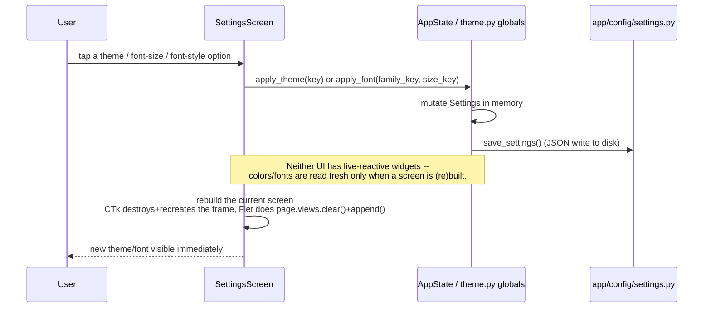
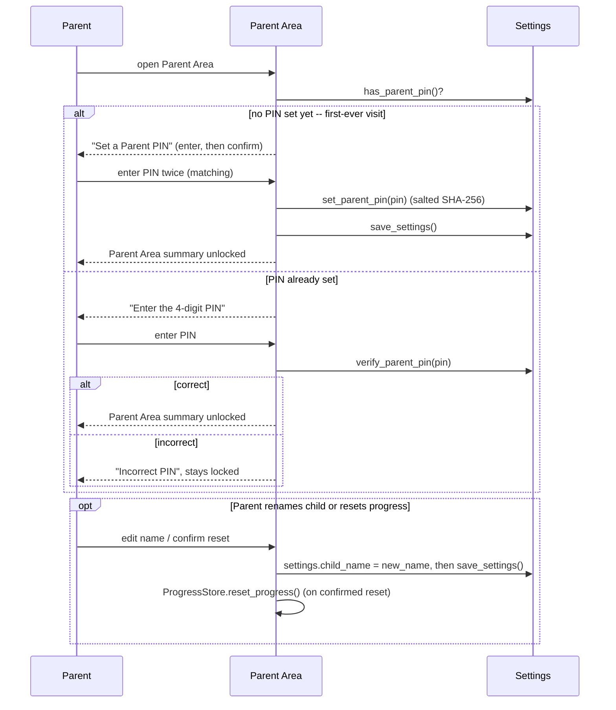
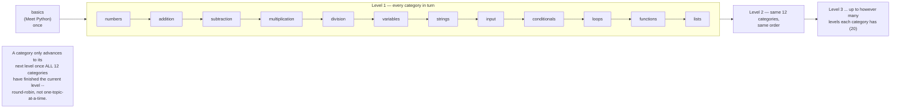
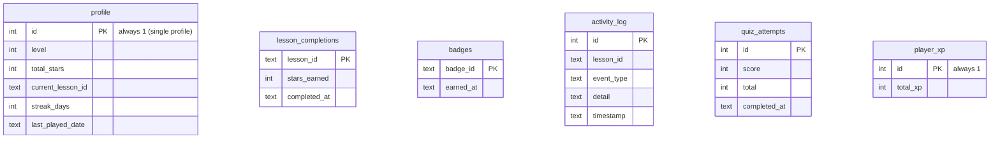

# Architecture

A reference for architects/engineers evaluating or extending this codebase:
system context, component structure, domain model (class diagrams), key
runtime flows (sequence diagrams), the persistence model, and the design
decisions behind them. For a plain-language feature tour see the
[README](../README.md); for a narrative walkthrough of each subsystem see
[DEVELOPMENT.md](DEVELOPMENT.md). This document is the structural/visual
counterpart to that narrative.

## 1. System context

Fully offline, single-user (one child profile per install), no backend.

No accounts, no cloud sync, no telemetry, no network calls anywhere in the
runtime path — the sandbox process is deliberately denied network access
as part of its safety model, and the app itself never makes an outbound
request.

## 2. Two UI codebases, one shared core

The single most important structural fact about this repo: **there are two
complete, parallel UI implementations of the same product**, chosen per
screen at import time by filename convention, not by a runtime feature
flag.

Neither UI imports from the other. `theme.py`/`theme_flet.py` are a
**deliberate duplicate** — same `ThemePreset`/`CategoryMeta`/`BadgeMeta`
shape and the same preset *keys*, independently-chosen concrete values per
platform (a CTk-only Windows font vs. Flet's bundled cross-platform font,
for instance). Once Flet reaches parity, the CTk tree and `runner.py` /
`worker.py` / `graphical_runner.py` are meant to be deleted — this is a
migration-in-progress, not a permanent fork.

## 3. Domain model — class diagram

The engine layer is pure, dependency-light Python: dataclasses plus
stateless(ish) loader/query classes. Nothing here imports `customtkinter`
or `flet`.

`App` (the CTk equivalent of `AppStateFlet`, in `app/ui/app_window.py`) is
structurally the same composition — `Settings` + `ProgressStore` +
`LessonEngine` + `QuizEngine` as instance attributes on the `ctk.CTk`
subclass itself — just without a `@property`-based theme/font resolver
(CTk's `theme.py` uses module-level globals reassigned by
`apply_theme()`/`apply_font()` instead, since CTk screens are destroyed
and rebuilt on navigation rather than holding a long-lived state object).

## 4. Sandbox architecture

Two independent execution engines exist side by side, both applying the
same static safety check first.

The in-process engine and the graphical runner are on a deliberate
convergence path: once the Flet lesson screen is the only one left,
`runner.py`, `worker.py`, and `graphical_runner.py` get deleted and
everything routes through one engine.

## 5. Sequence diagrams

### 5.1 App startup and initial routing

### 5.2 Running code and completing a lesson

### 5.3 Settings change (theme or font) and live repaint

### 5.4 Parent Area — first visit sets a PIN, later visits verify it

## 6. "Today's Mission" — computed, not stored

A frequently-asked design question, worth a dedicated diagram: nothing
about lesson *order* is stored anywhere in the database. It's recomputed
from lesson content every time.

`LessonEngine.main_path_lessons()` walks `category`/`category_level`
fields on lesson content to build this sequence fresh on every call;
`resolve_current()` just finds the first ID in that sequence not present
in `completed_lesson_ids`. Games, Snake, Code Crackers, the Python
Learning course's `course_*` categories, and every other bonus category
are simply never included in this walk — they're reached exclusively
through the category browser (or, for the course, its own chapter
screens), which uses the same content but a different, independent
traversal (`lessons_in_category()` sorted by `category_level`,
unlock-gated by `is_unlocked()`).

## 7. Persistence model

Two separate files per install, both resolved by
`app/config/platform_paths.py`'s `resolve_platform_data_dir()` (Windows:
`%APPDATA%\PythonAdventure\`; Android: the app's sandboxed storage dir).

`settings.json` (separate file, not SQLite — small, human-editable key/value
config) holds `child_name`, `sound_enabled`, `theme`, `font_family`,
`font_size`, `parent_pin_salt`/`parent_pin_hash` (PIN is salted SHA-256,
never stored in plaintext), and `setup_complete`. `load_settings()` filters
incoming JSON keys against `Settings.__dataclass_fields__` before
construction, so an old file missing new fields (or a newer file with
fields this version doesn't know about) never crashes — a new field just
takes its dataclass default.

## 8. Cross-cutting design decisions

- **Content is data, not code.** Every lesson and quiz question is a YAML
  file under `content/`. Adding, editing, or removing one never requires
  an app-code change — `LessonEngine`/`QuizEngine` just re-glob the
  directory on next load.
- **Derived state over stored state.** Category unlock status, module/
  mission progress, category mastery percentages, and badge eligibility
  are all *computed live* from `completed_lesson_ids` + `get_badge_ids()`
  on every read, never cached in their own schema. This is what makes
  content changes (adding a lesson, reordering a category) retroactively
  correct for existing save files with zero migration code.
- **Semantic settings keys, per-UI concrete mapping.** `theme`,
  `font_family`, and `font_size` in `Settings` are abstract keys (e.g.
  `"classic"`), not literal color hexes or font names. Each UI's own
  `theme.py`/`theme_flet.py` maps the same key to whatever's actually
  appropriate on that platform (a Windows-only system font vs. a bundled
  cross-platform one) via a `dict.get(key, DEFAULT)` — so the one shared
  `settings.json` is meaningful (and safely falls back) no matter which
  UI last wrote it.
- **Two sandbox engines by necessity, not by design preference.** Android
  forbids spawning a sibling OS process from a sandboxed app, so the
  subprocess-based engine (real OS-level timeout, strongest isolation)
  can't be the only implementation. The in-process engine exists purely
  to make Android possible and is intended to fully replace the subprocess
  one once the Flet UI is complete (see Section 4).
- **A course chapter is just a category; a quiz item is just a Lesson.**
  The Python Learning course (Section 6 note above) deliberately reuses
  the existing category/`is_unlocked()`/`complete_lesson()` machinery
  instead of a parallel "chapter" content model, and models its quiz
  item as a `Lesson` with an `is_quiz` flag rather than a new content
  type — so quiz completion gets unlock tracking, star rewards, and XP
  for free, and the course needed zero new `ProgressStore` schema.
- **Dual-UI parity by convention, not abstraction.** Rather than building
  a shared widget/view abstraction over both CTk and Flet (which would
  constrain both to their lowest common capability), each UI is a
  complete, independent implementation against the same core. This costs
  duplicate UI code but keeps each UI free to use its platform's real
  capabilities (e.g. Flet's animated overlays, CTk's native Windows
  dialogs) without a leaky shared abstraction in between.
